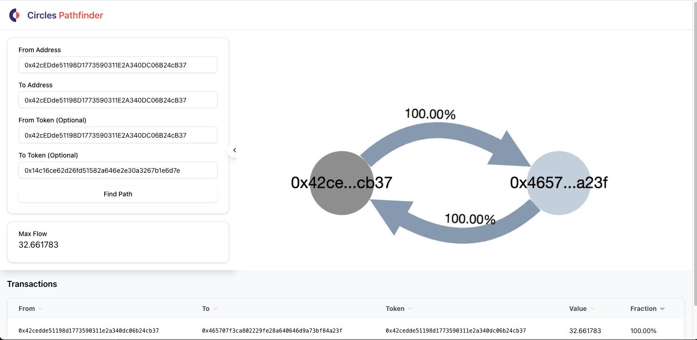

# Circles Flow Visualization

A React-based visualization tool for exploring and analyzing transaction paths in the Circles network. This application provides an interactive interface to visualize token transfer paths between addresses and analyze maximum flow capacity.

 

## Features

- Interactive graph visualization of token transfer paths
- Filter paths by token inclusion or exclusion
- Adjustable capacity range slider
- Detailed transaction table with sorting capabilities
- Flow matrix parameter generation for executing transfers
- Tabbed interface for transaction details and path parameters
- Profile information display for nodes and token owners
- Support for wrapped token visualization

## Technology Stack

- **React 18.2** - Frontend framework
- **Cytoscape.js** - Graph visualization library
- **Tailwind CSS** - Utility-first CSS framework
- **Radix UI** - Unstyled, accessible UI components
- **Lucide React** - SVG icons
- **Vite** - Build tool and development server
- **Circles SDK** - For interacting with the Circles network

## Prerequisites

- Node.js (version 16 or higher)
- npm or yarn package manager

## Installation

1. Clone the repository:
```bash
git clone [repository-url]
cd flow-visualization
```

2. Install dependencies:
```bash
npm install
```

3. Start the development server:
```bash
npm run dev
```

## Project Structure

The application follows a modular architecture that separates concerns into specialized components, hooks, and services:

```
src/
├── components/
│   ├── ui/
│   │   ├── button.jsx               # Button component
│   │   ├── card.jsx                 # Card component
│   │   ├── header.jsx               # Application header
│   │   ├── input.jsx                # Input fields
│   │   ├── token-input.jsx          # Token input with multi-entry support
│   │   ├── toggle-switch.jsx        # Toggle switch component
│   │   ├── tooltip.jsx              # Tooltip for hover information
│   │   ├── tabs.jsx                 # Tabbed interface component
│   │   └── transaction_table.jsx    # Transaction data table
│   ├── CollapsibleSidebar.jsx       # Sidebar with form controls
│   ├── CytoscapeVisualization.jsx   # Graph visualization component
│   ├── FlowMatrixParams.jsx         # Flow matrix parameter display
│   ├── FlowVisualization.jsx        # Main application component
│   └── PathFinderForm.jsx           # Path finding form
├── hooks/
│   ├── useCytoscape.js              # Manages Cytoscape graph instance
│   ├── useFormData.js               # Manages form state and input
│   └── usePathData.js               # Manages API data and related state
├── services/
│   └── circlesApi.js                # API integration layer
├── lib/
│   └── utils.js                     # Utility functions
├── App.jsx                          # Root application component
└── main.jsx                         # Application entry point
```

## Modular Architecture

### 1. Core Components

- **FlowVisualization**: Main controller component that coordinates all sub-components and hooks
- **CytoscapeVisualization**: Responsible for rendering the graph visualization
- **CollapsibleSidebar**: Contains form controls and manages sidebar state
- **PathFinderForm**: Form for path finding parameters
- **FlowMatrixParams**: Displays flow matrix parameters for path execution

### 2. Custom Hooks

- **useFormData**: Manages form state, validation, and submission
- **usePathData**: Handles API data fetching, processing, and related state
- **useCytoscape**: Manages Cytoscape graph instance, events, and styling

### 3. Services

- **circlesApi.js**: Centralizes API calls and SDK integration

### 4. UI Components

Reusable UI components in the `ui/` directory that provide consistent styling and behavior across the application.

## API Integration

The application connects to the Circles network API endpoint for path finding. The default endpoint is: `https://rpc.aboutcircles.com/`

### API Parameters

The path finding request supports these parameters:

- `Source`: Source address
- `Sink`: Destination address
- `TargetFlow`: Transfer amount (in wei)
- `FromTokens`: (Optional) Source token addresses
- `ToTokens`: (Optional) Destination token addresses
- `ExcludedFromTokens`: (Optional) Source tokens to exclude
- `ExcludedToTokens`: (Optional) Destination tokens to exclude
- `WithWrap`: Boolean flag to include wrapped tokens

## Extending the Application

### Adding a New Field to Path Request

Let's walk through an example of how to add a new field to the path request, such as a `MaxHops` parameter to limit the number of hops in a path.

#### 1. Update the Form Data Hook

First, modify the `useFormData.js` hook to include the new field:

```javascript
// src/hooks/useFormData.js
export const useFormData = () => {
  const [formData, setFormData] = useState({
    From: '0x42cEDde51198D1773590311E2A340DC06B24cB37',
    To: '0x14c16ce62d26fd51582a646e2e30a3267b1e6d7e',
    FromTokens: '0x42cEDde51198D1773590311E2A340DC06B24cB37',
    ToTokens: '',
    ExcludedFromTokens: '',
    ExcludedToTokens: '',
    crcAmount: '1000', 
    Amount: '1000000000000000000000',
    WithWrap: true,
    IsFromTokensExcluded: false,
    IsToTokensExcluded: false,
    MaxHops: 5, // New field for maximum hops
  });
  
  // Add handler for the new field
  const handleMaxHopsChange = (value) => {
    setFormData(prev => ({
      ...prev,
      MaxHops: value
    }));
  };

  return {
    // Other return values...
    handleMaxHopsChange
  };
};
```

#### 2. Update the API Service

Next, modify the API service to include the new parameter in the request:

```javascript
// src/services/circlesApi.js
export const findPath = async (formData) => {
  try {
    // Existing code...
    
    // Create the params object for the JSON-RPC request
    const params = {
      Source: formData.From,
      Sink: formData.To,
      TargetFlow: formData.Amount,
      // Add new parameter
      MaxHops: formData.MaxHops
    };
    
    // Rest of the existing code...
  } catch (err) {
    console.error('Fetch error:', err);
    throw err;
  }
};
```

#### 3. Add UI Controls

Add UI controls for the new field in the `PathFinderForm` component:

```jsx
// src/components/PathFinderForm.jsx
const PathFinderForm = ({
  formData,
  handleInputChange,
  handleTokensChange,
  handleWithWrapToggle,
  handleFromTokensExclusionToggle,
  handleToTokensExclusionToggle,
  handleMaxHopsChange, // New handler
  onFindPath,
  isLoading,
  pathData,
  minCapacity,
  setMinCapacity,
  maxCapacity,
  setMaxCapacity,
  boundMin,
  boundMax
}) => {
  return (
    <Card>
      <CardContent className="space-y-4 pt-4">
        {/* Existing form fields... */}
        
        {/* New field for MaxHops */}
        <div>
          <label className="block text-sm font-medium mb-1">
            Maximum Hops
          </label>
          <Input
            type="number"
            min="1"
            max="10"
            value={formData.MaxHops}
            onChange={(e) => handleMaxHopsChange(parseInt(e.target.value))}
            className="w-full"
          />
        </div>
        
        {/* Rest of the form... */}
      </CardContent>
    </Card>
  );
};
```

#### 4. Pass the Props Through Component Chain

Update the component hierarchy to pass the new props:

```jsx
// src/components/FlowVisualization.jsx
const FlowVisualization = () => {
  // Existing code...
  
  const { 
    formData, 
    handleInputChange, 
    handleTokensChange, 
    handleWithWrapToggle,
    handleFromTokensExclusionToggle,
    handleToTokensExclusionToggle,
    handleMaxHopsChange // New handler
  } = useFormData();
  
  return (
    <div className="flex flex-col h-screen bg-gray-50">
      <Header />
      <div className="flex flex-col mt-16">
        <div className="flex flex-1 min-h-[50vh]">
          <CollapsibleSidebar
            // Existing props...
            handleMaxHopsChange={handleMaxHopsChange}
            // Other props...
          />
          {/* Rest of the component... */}
        </div>
      </div>
    </div>
  );
};

// src/components/CollapsibleSidebar.jsx
const CollapsibleSidebar = ({
  // Existing props...
  handleMaxHopsChange,
  // Other props...
}) => {
  return (
    <div className="...">
      {!isCollapsed && (
        <div className="p-4 space-y-4">
          <PathFinderForm
            // Existing props...
            handleMaxHopsChange={handleMaxHopsChange}
            // Other props...
          />
        </div>
      )}
    </div>
  );
};
```

With these changes, the application now supports a new "Maximum Hops" parameter in the path finding request.

## Development

### Building for Production

```bash
npm run build
```

### Running Tests

```bash
npm run test
```

### Linting

```bash
npm run lint
```

### Deployment

To deploy to GitHub Pages:

```bash
npm run deploy
```

## Contributing

Contributions are welcome! Please feel free to submit a Pull Request.

## License

This project is licensed under the MIT License - see the [LICENSE](LICENSE) file for details.