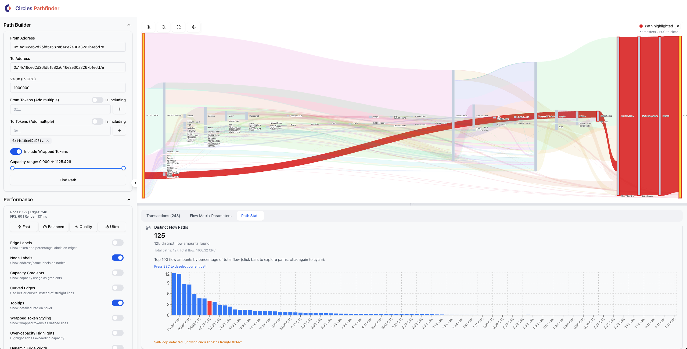

# Circles Flow Visualization

A React-based visualization tool for exploring and analyzing transaction paths in the Circles network. This application provides an interactive interface to visualize token transfer paths between addresses and analyze maximum flow capacity.


  

## Uses

- React 18.2
- Cytoscape.js with Dagre layout
- Tailwind CSS
- Radix UI components
- Lucide React icons
- Vite build tool

## Prerequisites

- Node.js (version 16 or higher)
- npm or yarn package manager

## Installation

1. Clone the repository:
```bash
git clone [repository-url]
cd flow-visualization
```

2. Install dependencies:
```bash
npm install
```

3. Start the development server:
```bash
npm run dev
```

## Project Structure

```
src/
├── components/
│   ├── ui/
│   │   ├── button.jsx
│   │   ├── card.jsx
│   │   ├── header.jsx
│   │   ├── input.jsx
│   │   └── transaction_table.jsx
│   └── FlowVisualization.jsx
├── lib/
│   └── utils.js
├── App.jsx
└── main.jsx
```

## API Integration

The application connects to a backend API endpoint for path finding. The default endpoint is `/api/findPath`. API parameters include:

- `from`: Source address
- `to`: Destination address
- `fromTokens`: (Optional) Source token address
- `toTokens`: (Optional) Destination token address
- `amount`: Transfer amount (in wei)


## Development

### Building for Production

```bash
npm run build
```

### Running Tests

```bash
npm run test
```

### Linting

```bash
npm run lint
```

## License

This project is licensed under the MIT License - see the [LICENSE](LICENSE) file for details.
