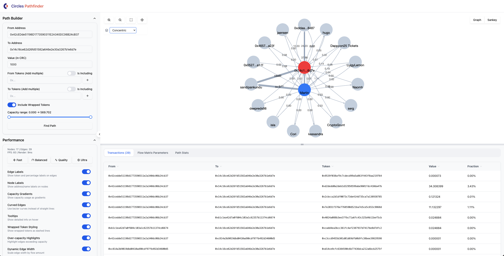

# Circles Flow Visualization

A React-based visualization tool for exploring and analyzing transaction paths in the Circles network. This application provides an interactive interface to visualize token transfer paths between addresses and analyze maximum flow capacity.

<p float="left">
  
  
</p>

## Features

### Core Functionality
- **Interactive Graph Visualization** - Real-time rendering of token transfer networks using Cytoscape.js
- **Sankey Diagram View** - Alternative visualization mode showing flow distribution
- **Dynamic Path Finding** - Find optimal transfer paths between addresses with configurable parameters
- **Token Filtering** - Include or exclude specific tokens in path calculations
- **Capacity Analysis** - Visualize and filter transfers based on flow capacity
- **Flow Matrix Parameters** - Generate `operateFlowMatrix` parameters for on-chain execution
- **Profile Integration** - Display human-readable names for addresses and tokens

### Visualization Features
- **Dual Visualization Modes** - Switch between Graph (Cytoscape) and Sankey (ECharts) views
- **Multiple Layout Algorithms** - Klay, Hierarchical, Dagre, Breadthfirst, Circle, and Concentric layouts
- **Self-Transfer Support** - Proper handling of circular flows when source equals sink
- **Path Highlighting** - Interactive path exploration through distinct flow analysis
- **Edge Styling** - Capacity gradients, wrapped token indicators, over-capacity highlights
- **Interactive Elements** - Hover tooltips, click-to-select transactions, zoom controls
- **Resizable Panels** - Adjustable interface sections for optimal viewing

### Performance Features
- **Adaptive Rendering** - Automatically adjusts visual complexity based on graph size
- **Performance Presets** - Quick switching between quality levels (Fast, Balanced, Quality, Ultra)
- **Progressive Loading** - Lazy loading of profile and balance data
- **Caching System** - In-memory and localStorage caching for API responses

## Technology Stack

- **React 18.2** - Frontend framework with hooks and context
- **Cytoscape.js** - Graph visualization library with klay and dagre layouts
- **ECharts** - Charting library for Sankey diagrams and metrics visualization
- **Tailwind CSS** - Utility-first CSS framework
- **Radix UI** - Accessible, unstyled UI primitives
- **Recharts** - Data visualization for metrics
- **Vite** - Build tool
- **Circles SDK** - Official SDK for Circles network interaction

## Prerequisites

- Node.js (version 16 or higher)
- npm or yarn package manager
- Modern web browser with ES6+ support

## Installation

1. Clone the repository:
```bash
git clone [repository-url]
cd flow-visualization
```

2. Install dependencies:
```bash
npm install
```

3. Start the development server:
```bash
npm run dev
```

The application will be available at `http://localhost:5173` (or the port shown in terminal).

## Project Structure

```
src/
├── components/
│   ├── metrics/                     # Modular metrics system
│   │   ├── BaseMetric.js           # Base class for all metrics
│   │   ├── DistinctPathsMetric.jsx # Path analysis with visualization
│   │   ├── DistinctTokensMetric.js # Token counting metric
│   │   ├── IntermediateNodesMetric.js # Node analysis
│   │   ├── PathEfficiencyMetric.js # Direct flow efficiency
│   │   ├── TransferCountMetric.js  # Transfer counting
│   │   ├── WrappedTokenMetric.jsx  # Wrapped token analysis
│   │   └── index.js                # Metric registry
│   ├── ui/                         # Reusable UI components
│   │   ├── button.jsx              # Button component
│   │   ├── card.jsx                # Card component
│   │   ├── header.jsx              # Application header
│   │   ├── input.jsx               # Input fields
│   │   ├── label.jsx               # Label component
│   │   ├── tabs.jsx                # Tabbed interface
│   │   ├── toggle-switch.jsx       # Toggle switch component
│   │   ├── token-input.jsx         # Multi-token input
│   │   ├── tooltip.jsx             # Hover tooltips
│   │   └── transaction_table.jsx   # Transaction data table
│   ├── visualizations/
│   │   ├── SankeyVisualization.jsx # Sankey diagram component
│   │   └── index.js                # Visualization exports
│   ├── CollapsibleLeftPanel.jsx    # Main control panel
│   ├── CytoscapeVisualization.jsx  # Graph rendering component
│   ├── FlowMatrixParams.jsx        # Parameter generation
│   ├── FlowVisualization.jsx       # Main application component
│   ├── GraphPerformanceControls.jsx # Performance settings
│   ├── PathFinderForm.jsx          # Path finding form
│   └── PathStats.jsx               # Path statistics display
├── contexts/
│   └── PerformanceContext.jsx      # Global performance state
├── hooks/
│   ├── useCytoscape.js            # Cytoscape integration hook
│   ├── useFormData.js             # Form state management
│   ├── useKeyboardShortcuts.js    # Keyboard shortcut handler
│   ├── usePathData.js             # API data management
│   └── usePerformanceMonitor.js   # Performance tracking
├── lib/
│   ├── flowPathComputation.js     # Path computation algorithms
│   ├── graphOptimizer.js          # Graph optimization utilities
│   └── utils.jsx                  # Utility functions
├── services/
│   ├── cacheService.js            # Caching implementation
│   └── circlesApi.js              # API integration layer
├── App.jsx                        # Root application component
├── main.jsx                       # Application entry point
└── index.css                      # Global styles
```

## Usage Guide

### Basic Path Finding

1. **Enter Addresses**:
   - **From Address**: Source address for the transfer
   - **To Address**: Destination address
   - **Value**: Amount to transfer in CRC

2. **Configure Tokens** (Optional):
   - Add specific tokens to include or exclude
   - Toggle between "Including" and "Excluding" mode
   - Enable/disable wrapped tokens

3. **Find Path**:
   - Click "Find Path" to compute the optimal route
   - The visualization will show all possible transfers

### Visualization Modes

#### Graph View (Cytoscape)
- **Blue nodes**: Source addresses
- **Red nodes**: Sink addresses
- **Yellow nodes**: Self-transfer nodes (when source = sink)
- **Gray nodes**: Intermediate addresses
- **Edge thickness**: Represents flow amount
- **Dashed edges**: Wrapped token transfers

#### Sankey View
- Shows flow distribution from source to sink
- Better for understanding flow proportions
- Handles self-transfers with virtual sink nodes

### Interactive Features

1. **Path Exploration**:
   - Click on bars in the "Distinct Flow Paths" metric
   - Highlights the selected path in the visualization
   - Click again to cycle through multiple paths with same flow
   - Press ESC to clear highlights

2. **Transaction Selection**:
   - Click on edges to select transactions
   - Selected transaction appears in the table below
   - View transaction details and parameters

3. **Capacity Filtering**:
   - Use the slider to filter edges by capacity range
   - Helpful for focusing on specific flow amounts

## Metrics System

The application includes various metrics for analyzing paths:

### Available Metrics

1. **Total Transfers** - Number of individual token transfers
2. **Intermediate Nodes** - Nodes between source and sink
3. **Distinct Tokens** - Number of unique tokens used
4. **Wrapped Token Usage** - Analysis of wrapped vs regular tokens
5. **Path Efficiency** - Direct flow efficiency calculation
6. **Distinct Flow Paths** - Interactive path analysis with visualization

### Path Analysis

The "Distinct Flow Paths" metric provides:
- Grouping of paths by flow amount
- Interactive bar chart for path exploration
- Support for self-transfer cycles
- Path highlighting in both Graph and Sankey views

## API Integration

### Circles Network API

The application connects to the Circles RPC endpoint:
- Default endpoint: `https://rpc.aboutcircles.com/`
- Methods used:
  - `circlesV2_findPath` - Path computation
  - `circles_getTokenBalances` - Balance and token info
  - Profile lookups via SDK

### Path Finding Parameters

```javascript
{
  Source: "0x...",              // Source address
  Sink: "0x...",                // Destination address
  TargetFlow: "1000000...",     // Amount in wei
  FromTokens: ["0x..."],        // Optional: source tokens
  ToTokens: ["0x..."],          // Optional: destination tokens
  ExcludedFromTokens: ["0x..."], // Optional: excluded source tokens
  ExcludedToTokens: ["0x..."],   // Optional: excluded dest tokens
  WithWrap: true                // Include wrapped tokens
}
```

## Self-Transfer Handling

When the source and sink addresses are the same, the application:
1. Detects the self-transfer condition
2. Creates a virtual sink node for visualization
3. Displays both nodes with yellow color
4. Shows the same label for consistency
5. Properly computes paths through the virtual sink
6. Maintains all interactive features

This ensures that circular flows are properly visualized without breaking the directed acyclic graph requirements of the visualization libraries.

## Keyboard Shortcuts

| Key | Action |
|-----|--------|
| `+` / `=` | Zoom in |
| `-` | Zoom out |
| `0` / `F` | Fit graph to screen |
| `C` | Center graph |
| `K` | Switch between Graph and Sankey view |
| `1-4` | Switch performance presets |
| `L` | Toggle edge labels |
| `G` | Toggle edge gradients |
| `T` | Toggle tooltips |
| `S` | Toggle sidebar |
| `ESC` | Clear path highlights |

## Performance Settings

### Performance Presets

1. **Fast (1)**:
   - Minimal visual features
   - Best for large graphs
   - Node labels remain visible

2. **Balanced (2)**:
   - Essential features only
   - Good performance/quality trade-off
   - Tooltips enabled

3. **Quality (3)**:
   - Most visual features enabled
   - Edge gradients and styling
   - Good for medium-sized graphs

4. **Ultra (4)**:
   - All features enabled
   - Curved edges, all visual enhancements
   - Best for small graphs

### Manual Controls

Toggle individual features:
- Edge Labels
- Node Labels
- Capacity Gradients
- Curved Edges
- Tooltips
- Wrapped Token Styling
- Over-capacity Highlights
- Dynamic Edge Width

## Development

### Building for Production

```bash
npm run build
```

The build output will be in the `dist/` directory.

### Running the Linter

```bash
npm run lint
```

### Preview Production Build

```bash
npm run preview
```

### Deploy to GitHub Pages

```bash
npm run deploy
```

## Extending the Application

### Adding a New Metric

Create a new metric in `src/components/metrics/`:

```javascript
import { createMetric, createMetricResult } from './BaseMetric';
import { YourIcon } from 'lucide-react';

export default createMetric({
  id: 'yourMetric',
  name: 'Your Metric Name',
  icon: YourIcon,
  description: 'What this metric measures',
  order: 50, // Display order
  
  calculate: (pathData, tokenInfo, nodeProfiles) => {
    // Your calculation logic
    const value = computeValue(pathData);
    
    return createMetricResult({
      value: value,
      description: 'Result description',
      details: 'Additional details',
    });
  }
});
```

Then register it in `src/components/metrics/index.js`.

### Adding Visualization Support

The visualization modes are designed to handle different graph structures:

1. **Graph View**: Best for exploring network topology
2. **Sankey View**: Best for understanding flow distribution

Both views support:
- Path highlighting
- Self-transfer flows
- Interactive exploration
- Synchronized state

## Cache Management

The application implements a two-tier cache:
- **Memory Cache**: Fast access for current session
- **LocalStorage Cache**: Persists between sessions

Cache settings:
- Profile data: 24-hour TTL
- Token info: 1-hour TTL
- Automatic cleanup when storage is full

Clear cache via Performance panel or programmatically:
```javascript
cacheService.clearAll();
```

## License

This project is licensed under the MIT License - see the LICENSE file for details.